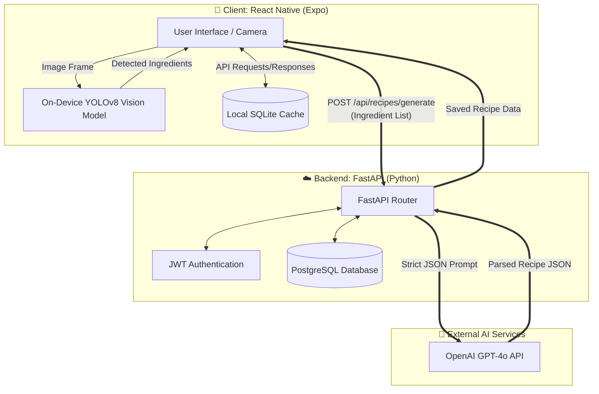
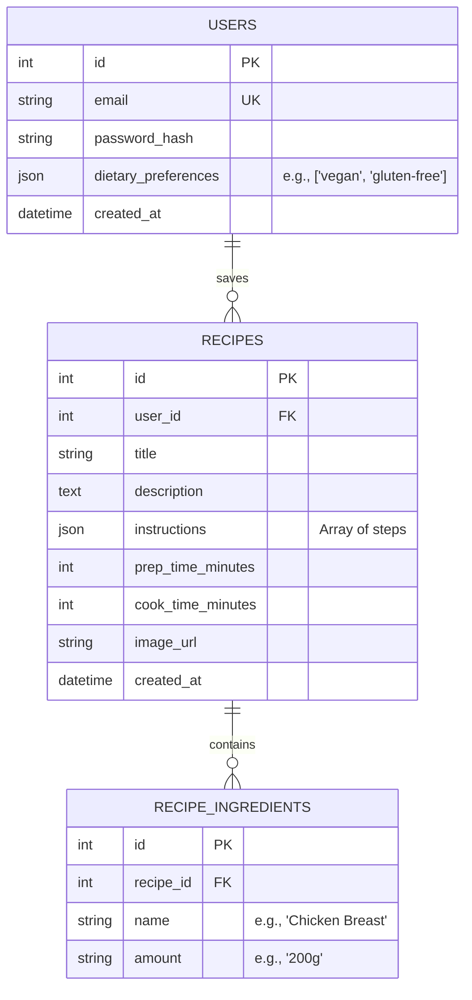

# System Design & Architecture: SnapChef

Before writing any more code, this document establishes the complete architectural foundation, database schema, and system design for the project.

## 1. System Architecture

The system follows a edge-to-cloud hybrid architecture to maximize performance and privacy. Object detection happens locally on the user's device (Edge), while the heavy Natural Language Processing happens in the cloud.



## 2. Database Design (Entity-Relationship)

To store user preferences, history, and saved recipes, we will use a relational database (PostgreSQL on the backend). 



## 3. API Contract Design

The backend will expose a RESTful API. Below are the core endpoints:

| Endpoint | Method | Auth Req | Description |
| :--- | :--- | :--- | :--- |
| `/api/auth/register` | `POST` | No | Creates a new user account. |
| `/api/auth/login` | `POST` | No | Returns a JWT access token. |
| `/api/auth/forgot-password` | `POST` | No | Generates a reset token (mocked via console). |
| `/api/auth/change-password` | `POST` | Yes | Changes the password for the authenticated user. |
| `/api/users/me` | `GET` | Yes | Retrieves the authenticated user's profile. |
| `/api/users/me` | `PUT` | Yes | Updates profile (e.g., dietary preferences). |
| `/api/recipes/generate` | `POST` | Yes | Calls the LLM and returns a recipe JSON. |
| `/api/recipes` | `POST` | Yes | Saves a generated recipe to the user's history. |
| `/api/recipes` | `GET` | Yes | Retrieves the user's saved recipes (History). |

### Payload Example: `/api/recipes/generate`
**Request:**
```json
{
  "ingredients": ["chicken", "broccoli", "soy sauce", "garlic"],
  "max_time_minutes": 30,
  "dietary_preferences": ["high-protein"]
}
```
**Response:**
```json
{
  "title": "Quick Garlic Soy Chicken & Broccoli",
  "prep_time": 10,
  "cook_time": 15,
  "ingredients": [
    {"name": "chicken", "amount": "2 breasts, sliced"},
    {"name": "broccoli", "amount": "1 head, chopped"}
  ],
  "instructions": [
    "Heat oil in a pan over medium heat.",
    "Add chicken and cook until browned."
  ]
}
```

## 4. UI/UX Flow (Mobile App)

1. **Authentication Flow:** Login / Sign Up screens.
2. **Dashboard:** Displays recently saved recipes and a prominent "Scan Fridge" button.
3. **Camera Screen:** Live camera view. When a photo is taken, the TFLite model processes it and draws bounding boxes around detected food items.
4. **Ingredient Confirmation Screen:** Shows a checklist of detected items. The user can manually add or remove items before hitting "Generate Recipe".
5. **Recipe Result Screen:** Beautifully renders the LLM's response, with a button to "Save to Cookbook".

## 5. Development Phases

### Phase 1.5: Extended Backend Features (Completed)
- Implement User Profile endpoints (`GET` and `PUT` `/api/users/me`).
- Implement Password Management (`/forgot-password` and `/change-password`).
- Implement Recipe History (`GET` and `POST` `/api/recipes`).

### Phase 2: Vision Model Preparation (YOLOv8 Edge) (Completed)
- Gather a robust food ingredient dataset (e.g., Roboflow).
- Train/fine-tune a lightweight model (YOLOv8n - Nano) to ensure it runs fast on a phone.
- Export the PyTorch model to an `int8` quantized `.tflite` format for maximum on-device speed.

### Phase 3: Mobile App Frontend (Current Focus)
- `[x]` Initialize Expo app with Nativewind (TailwindCSS) for styling.
  - Scaffolded via `create-expo-app` (SDK 57, `expo-router`, TypeScript, `src/app` structure) into `mobile/`.
  - Nativewind v4 wired: `tailwind.config.js`, `babel.config.js`, `metro.config.js`, `src/global.css` (Tailwind directives), imported from `src/app/_layout.tsx`.
- `[ ]` UI Framework additions: Use `expo-blur` to achieve the ultra-premium Apple/Spotify glassmorphism effects we designed.
- `[ ]` Integrate `react-native-vision-camera` and `react-native-fast-tflite` to process frames and draw real-time bounding boxes using the exported YOLO model.
- `[ ]` API Client: Setup Axios with `expo-secure-store` to manage JWT tokens and communicate with our FastAPI backend.


---
## User Review Required: Phase 3 (Mobile App Frontend)

We are ready to start building the mobile app! Here is the proposed technical stack for the frontend:
1. **Framework:** React Native with Expo (specifically using Expo Router for modern, file-based navigation).
2. **Styling:** NativeWind (Tailwind CSS) + `expo-blur`. This allows us to rapidly build the exact ultra-premium, dark-mode glassmorphic designs we generated.
3. **AI Vision:** `react-native-vision-camera` + `react-native-fast-tflite`. This will load your exported `.tflite` model locally on the phone to detect ingredients in real-time without needing an internet connection for the vision part.

**Open Questions:**
1. Are you comfortable using Expo and NativeWind (Tailwind) for the frontend, or would you prefer a different UI approach?
2. Did you successfully download the `best_saved_model.tflite` (or the zip file) from Google Colab? We will need to copy this file into our new app's assets folder!
