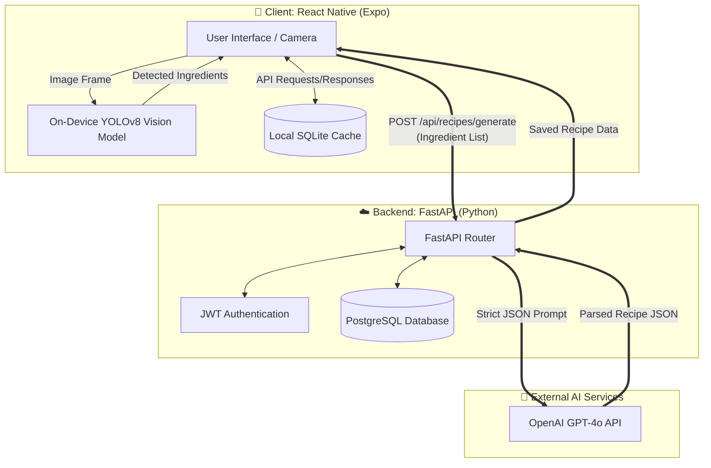
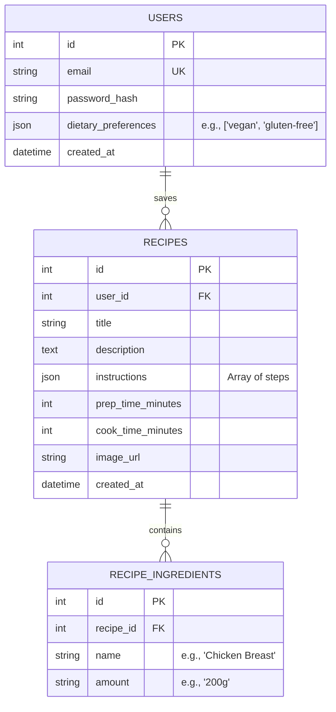

# System Design & Architecture: SnapChef

Before writing any more code, this document establishes the complete architectural foundation, database schema, and system design for the project.

## 1. System Architecture

The system follows a edge-to-cloud hybrid architecture to maximize performance and privacy. Object detection happens locally on the user's device (Edge), while the heavy Natural Language Processing happens in the cloud.



## 2. Database Design (Entity-Relationship)

To store user preferences, history, and saved recipes, we will use a relational database (PostgreSQL on the backend). 



## 3. API Contract Design

The backend will expose a RESTful API. Below are the core endpoints:

| Endpoint | Method | Auth Req | Description |
| :--- | :--- | :--- | :--- |
| `/api/auth/register` | `POST` | No | Creates a new user account. |
| `/api/auth/login` | `POST` | No | Returns a JWT access token. |
| `/api/recipes/generate` | `POST` | Yes | Takes an array of ingredient strings, calls the LLM, and returns a recipe JSON. |
| `/api/recipes` | `POST` | Yes | Saves a generated recipe to the user's profile. |
| `/api/recipes` | `GET` | Yes | Retrieves a paginated list of the user's saved recipes. |

### Payload Example: `/api/recipes/generate`
**Request:**
```json
{
  "ingredients": ["chicken", "broccoli", "soy sauce", "garlic"],
  "max_time_minutes": 30,
  "dietary_preferences": ["high-protein"]
}
```
**Response:**
```json
{
  "title": "Quick Garlic Soy Chicken & Broccoli",
  "prep_time": 10,
  "cook_time": 15,
  "ingredients": [
    {"name": "chicken", "amount": "2 breasts, sliced"},
    {"name": "broccoli", "amount": "1 head, chopped"}
  ],
  "instructions": [
    "Heat oil in a pan over medium heat.",
    "Add chicken and cook until browned."
  ]
}
```

## 4. UI/UX Flow (Mobile App)

1. **Authentication Flow:** Login / Sign Up screens.
2. **Dashboard:** Displays recently saved recipes and a prominent "Scan Fridge" button.
3. **Camera Screen:** Live camera view. When a photo is taken, the TFLite model processes it and draws bounding boxes around detected food items.
4. **Ingredient Confirmation Screen:** Shows a checklist of detected items. The user can manually add or remove items before hitting "Generate Recipe".
5. **Recipe Result Screen:** Beautifully renders the LLM's response, with a button to "Save to Cookbook".

## 5. Development Phases

### Phase 1: Backend & Database (Current Focus)
- Set up PostgreSQL database and SQLAlchemy ORM models.
- Implement JWT Authentication.
- Build the `/generate` endpoint using OpenAI Structured Outputs to match the DB schema.

### Phase 2: Vision Model Preparation (YOLOv8)
- Gather a robust food ingredient dataset (e.g., Roboflow Food-Ingredients).
- Train/fine-tune YOLOv8.
- Export the PyTorch model to `float16` or `int8` quantized `.tflite` for mobile.

### Phase 3: Mobile App Frontend
- Initialize Expo app with Nativewind (TailwindCSS) for styling.
- Integrate `react-native-fast-tflite` and the camera package.
- Wire up the API calls to the Phase 1 backend.

---
## User Review Required

Please review this comprehensive system design. 
1. **Database:** Does the PostgreSQL schema look sufficient for your needs?
2. **App Flow:** Does the step-by-step UX flow (Scan -> Confirm Ingredients -> Generate) match your vision?
